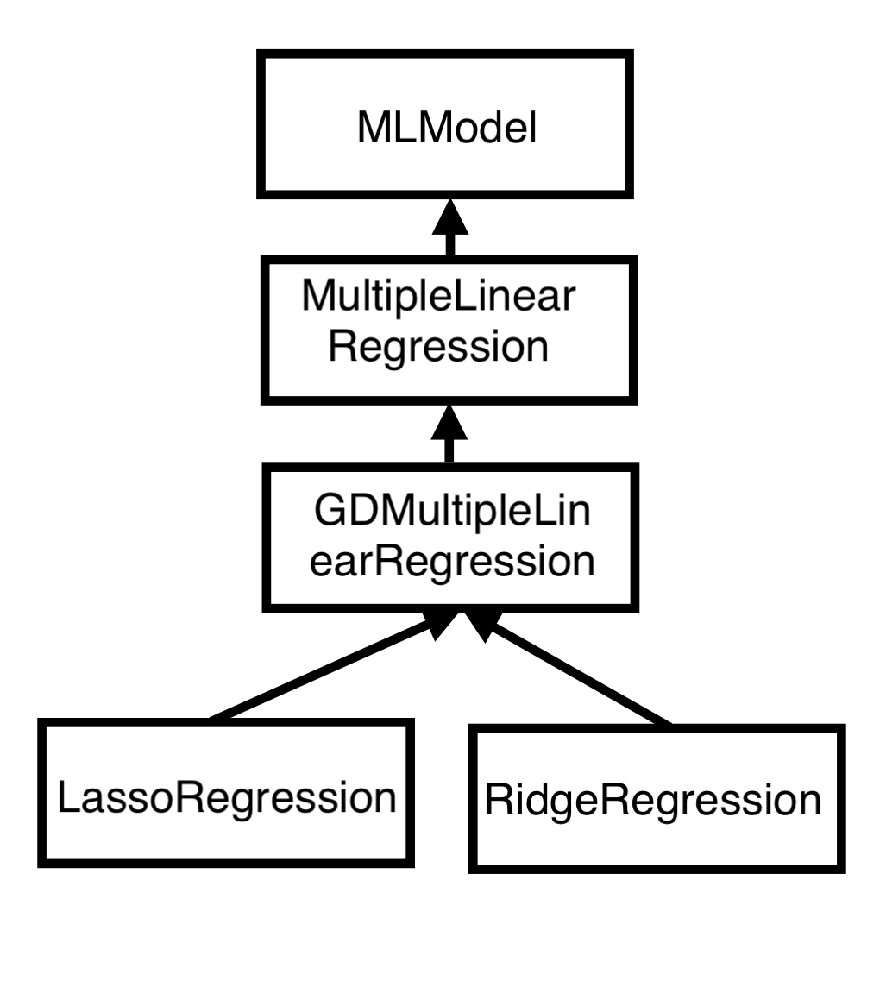

# README

This repository implements the following classes: MLModel (the abstract based class), MultipleLinearRegression, GDMultipleLinearRegression, LassoRegression, RidgeRegression and LossFunction. 

The image below explains how inheritance was carried out through the different classes.

**MLModel()**

Abstract based class for every machine learning model. There are three methods that were instantiated in it:
- predict(): since machine learning models need to carry out prediction on a specific set of data given some weights
- train(): method used for tuning the weights, at least one of the parameters needs to be defined.
- setters and getters for the weights, that are private attributes.

**MultipleLinearRegression()**

This class inherits from the abstract based class and defines the methods described in the abstract based class. 

**GDMultipleLinearRegression()**

This class implements the multiple linear regression with gradient descent. There are some arguments that have default values in case the user didn't define them. The choise of implementing alfa, the number of iterations, lamba and the initialization of the weights as attributes instead of arguments of a function comes from a possible need of tuning hyperparameters.
The train() function is overriden. This class implemets the following methods to carry out the training itself:

- _logging(): this method is responsible for creating a log file where the mean absolute error and the mean squared error is stored for each iteration.
- _initialize_weights(): this method initialized the weights for gradient descent based on a string that specifies the distribution (uniform or normal). 
- _loss_gradient(): the method takes care of evaluating the gradient of the mean squared error
- _gradient_descent(): method implementing the loop to evaluate the gradient (calling _initialize_weights() in teh beginning and _loss_gradient() to update the weights for every iteration)

Finally the training function after reshaping the input for avoiding broadcasting issues calls the _gradient_descent() and carries out the training of the model by updating the weights.

**LassoRegression()**

This class inherits from the GDMultipleLinearRegression, since Lasso regression is a kind of multiple linear regression that carries out the training with gradient descent.
The only difference lies in the _loss_gradient function() that is overriden compared to the classs it inherits from.

**RidgeRegression()**

This class inherits from GDMultipleLinearRegression because, similar to lasso regression, it belongs to the category of multiple linear regression where training is conducted using gradient descent. However, it distinguishes itself by employing a distinct loss function.

**LossFunction**

This is an aider class that evaluetes the mean squared errors and the mean absolute errors by appying regularization (the weights L1 for lasso and L2 for ridge). These are used in the logging file.

**ModelSaver and RegressionPlotter**

These files where modified to be coherent with the implemetations of getters and setters with the @property function.