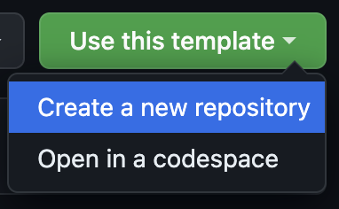

# OOP - 2023/24 - Assignment 2

This is the base repository for assignment 2.
Please follow the instructions given in the [PDF](https://brightspace.rug.nl/content/enforced/243046-WBAI045-05.2023-2024.1/assignment%202_v1.1.pdf) for the content of the exercise.

## How to carry out your assignment

**PLEASE FOLLOW THESE STEPS:**

1. Use this template and create a private repository:
   
2. Please add your partner and `oop-otoz` to the collaborators.
3. Create a new branch called `submission` **before adding any files**.
4. Add your code in the `main` branch (**IF YOU DO NOT ADD ANYTHING, THE PULL REQUEST WILL NOT WORK**).
5. Make sure that Actions are allowed: Settings -> Actions -> General -> Allow all actions and workflows.
6. Create a pull request from the `main` branch to your `submission` branch and check that your changes are captured.
7. Now finish your solution.
8. When you are ready to submit, add `oop-otoz` to the reviewers.

**Notes:**

- **Leave the \*\***init\***\*.py files untouched**.
- Do not move the `main.py` files.
- Do not move `requirements.txt`.
- Make the pull request AFTER SUBMITTING SOME CHANGES.

Below this line, you can write your report to motivate your design choices.

## Submission

The code should be submitted on GitHub by opening a Pull Request from the `main` branch on to the `submission` branch. This means that `submission` is the base branch and `main` the compare branch. **Make sure to push your code only to `main`!**

There are automated checks that verify that your submission is correct:

1. Deadline - checks that the last commit in a PR was made before the deadline.
2. Reproducibility - downloads libraries included in `requirements.txt` and runs `python3 main.py`. If your code does not throw any errors, it will be marked as reproducible. **Make sure it is reproducible before submission!**
3. Style - runs `flake8` on your code to ensure adherence to style guides.
4. Tests - runs `unittest` on your tests in `part_1/tests` to make sure all tests succeed.

---

## Your report
to do:
- write report for both p1 and p2
- comments (?) --> how much?
- double check type-hints/docstrings
- add typhints for @property in multiple linear regression + abc
- type checks for loss_function.py + check docstring some things are missng + raise errors
- raise an error in the model saver --> load weights if the given file has the wrong extention
- PUBLIC AND PRIVATE ATTRIBUTES IN THE METHODS

- REGRESSION PLOTTER SHOLD WORK AS WELL!!!!

Questions:
- should the gradient be in a separate class? --> if so do the loss functions as well
- should init be in the abc?
- is abc_ML correct ???
- should the @property be docstringed in teh abc class

##Part 1

**Codemaker
Manages Mastermind's solution with private attributes _colors and _code (which should therefore not be modified by the user) and public attribute max_iterations, set by the user at the start of the game.

Methods:

_guess_errors(): raises errors on the user input. Private because the guess format is given at the beginning nd should not be modified.

_make_code(self): ìgenerates a random combination of code. Private since the secret code should not be modified by the user.

get_code(): provides a way for the user to retrieve the secret code. Public becasue it allows users to access the value of the secret code safely.

_correct_guesses_right_pos() and _correct_guesses_wrong_pos(): compare a guess with the secret code and return the number of correct guesses in the right/wrong position. Private becasue internal details of the code evaluation process should be kept hidden from the user.

**Mastermind
Inherits from Codemaker and runs the actual game. Its attributes are inherited from Codemaker.
The additional methods are:

_formatting_guess(): ìensures that the input given by the user is converted to uppercase. Private becasue internal details of the game's input processing shouldn't be public.

game(): public method that is called in the main and takes care of carrying out the game. It generates the secret code, prompts the user to input their guesses, receives user input guesses, and provides feedback to the user. After the max_iterations iterations are complete, the correct answer is revealed.
